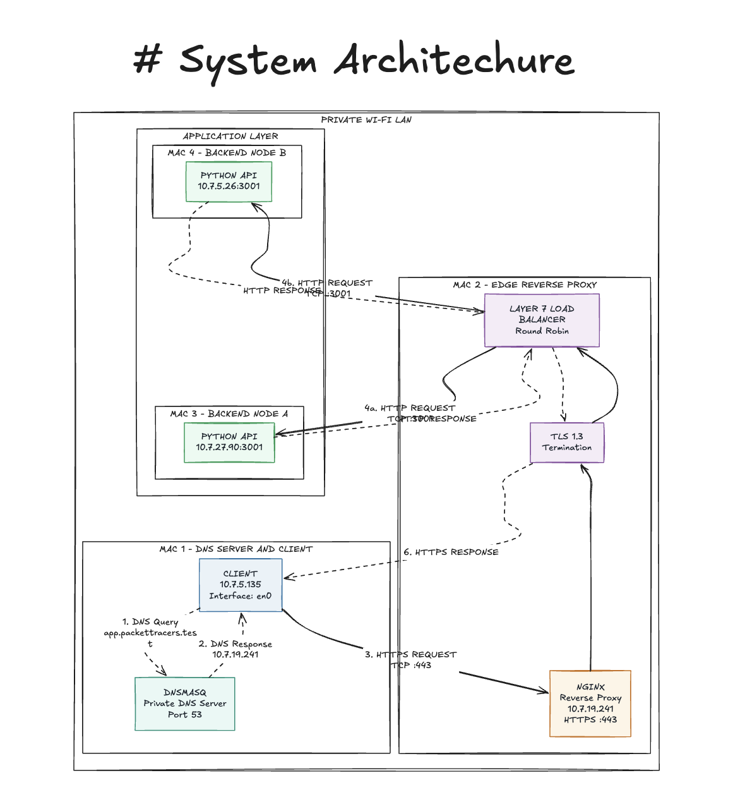
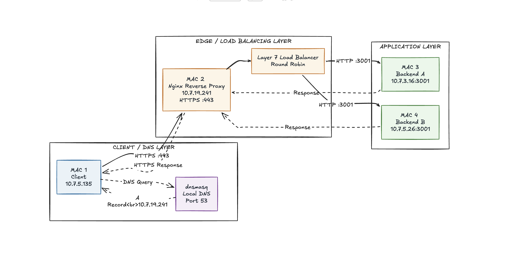
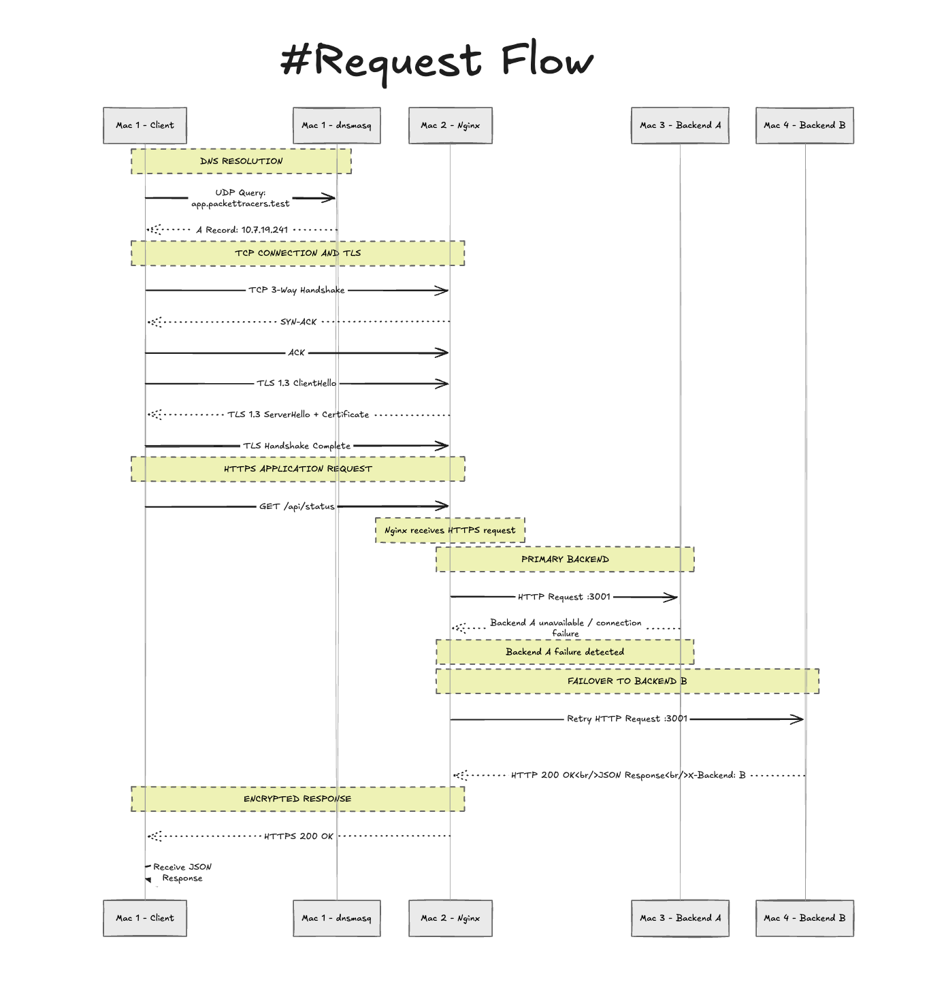

# Private Network Service Platform - Phase 1

This repository contains the configuration, source code, and evidence for a 4-node distributed web architecture built for the Computer Networks course project.

## Team Packet Tracers - Machine Roles & IP Inventory

| Machine | Role | Private IP | Interface | Services |
| :--- | :--- | :--- | :--- | :--- |
| **Mac 1** | DNS Server & Client | `10.7.5.135` | `en0` | `dnsmasq`, `dig`, `curl`, Wireshark |
| **Mac 2** | Edge Reverse Proxy | `10.7.19.241` | `en0` | `nginx`, TLS Certificates |
| **Mac 3** | Backend Node A | `10.7.27.90` | `en0` | Python API (Port 3001) |
| **Mac 4** | Backend Node B | `10.7.5.26` | `en0` | Python API (Port 3001) |

---

## Course Topic Mapping

This project directly maps classroom networking theory into a working local environment:

*   **Moving Data Through the Core:** A client request leaves Mac 1, crosses the local Wi-Fi LAN to Mac 2, is proxied to Mac 3/4, and returns. This flow is captured and documented via Wireshark.
*   **OSI vs TCP/IP Model:** We mapped our application flow to the correct layers: DNS/HTTP (Application), TLS (Session/Presentation overlay / Transport), TCP/UDP (Transport), IP (Network), and Ethernet (Link).
*   **Devices, Topologies, Cloud Concepts:** The local topology mirrors cloud equivalents: Mac 1 acts as Route 53 (managed DNS), Mac 2 acts as an AWS ALB/CloudFront edge (load balancer), and Mac 3/4 act as EC2 application servers.
*   **HTTP/1.1, HTTP/2, REST:** A small REST API was built on the backends returning JSON payloads over HTTP/1.1. 
*   **HTTPS and TLS:** TLS is terminated securely at the Nginx edge (Mac 2), capturing the handshake and certificate validation.
*   **DNS and Route 53 Concepts:** A private DNS zone (`app.packettracers.test`) was created and resolved through the team's DNS server.
*   **Transport Layer (Ports, TCP/UDP):** Service ports (53, 443, 3001) are identified, and the TCP 3-way handshake is established before application data is exchanged.
*   **Reliable Data Transfer (TCP Flow Control):** Sequence and acknowledgement numbers are tracked via Wireshark to ensure TCP reliability.
*   **CDNs and Caching:** Caching is actively demonstrated using HTTP `Cache-Control` and `ETag` headers for 304 validation.
*   **Cloud Load Balancing:** Nginx is configured as a local load balancer, distributing traffic across backends identically to an AWS ALB.

---

## 1. Architecture & Request Flow

Our local area network utilizes a completely private test namespace (`app.packettracers.test`). The request flow through our architecture operates as follows:
1. **Client (Mac 1)** initiates a request for the domain.
2. **DNS Query (Mac 1)** intercepts the request via `dnsmasq` and resolves it to Mac 2's IP.
3. **HTTPS Request (Mac 2)** catches the traffic via Nginx, terminates the TLS 1.3 encryption, and proxies the request.
4. **Backend A (Mac 3) or Backend B (Mac 4)** receives the load-balanced HTTP request and returns the JSON payload.

### System Architecture Diagram


### Topology Diagram


### Request Flow Diagram


## 2. Configuration Bundle

### DNS Configuration (Mac 1)
Located in `/config/dnsmasq.conf`:
```text
address=/app.packettracers.test/10.7.19.241
address=/api.packettracers.test/10.7.19.241
listen-address=10.7.5.135,127.0.0.1
interface=en0
```

### Nginx Edge Configuration (Mac 2)
Located in `/config/nginx.conf`:
```nginx
upstream my_backends {
    server 10.7.27.90:3001;
    server 10.7.5.26:3001;
}

server {
    listen 443 ssl;
    server_name app.packettracers.test api.packettracers.test;

    ssl_certificate /opt/homebrew/etc/nginx/server.crt;
    ssl_certificate_key /opt/homebrew/etc/nginx/server.key;

    location / {
        proxy_pass http://my_backends;
    }
}
```

## 3. Deployment & Launch Instructions

### Step 1: Start Backends (Mac 3 & Mac 4)
Navigate to the `/backend` directory and start the Python application on port 3001:
```bash
python3 server.py
```
*(Note: Replace `server.py` with the exact name of your Python script if different).*

### Step 2: Start Edge Proxy (Mac 2)
Ensure the SSL certificates are generated in `/opt/homebrew/etc/nginx/` and reload Nginx:
```bash
sudo nginx -t
sudo nginx -s reload
```

### Step 3: Flush DNS (Mac 1)
Clear the local DNS cache to ensure routing uses the `dnsmasq` private namespace:
```bash
sudo dscacheutil -flushcache; sudo killall -HUP mDNSResponder
```

## 4. Mandatory Build Tasks & Evidence

### Task A: Establish the Private LAN
All machines were connected to the same private Wi-Fi network and verified for basic reachability using ICMP ping. 

**Evidence (Client Mac 1 to Proxy Mac 2):**
```text
aditsingh@Adits-MacBook-Pro-2 ~ % ping -c 4 10.7.19.241
PING 10.7.19.241 (10.7.19.241): 56 data bytes
64 bytes from 10.7.19.241: icmp_seq=0 ttl=63 time=17.489 ms
64 bytes from 10.7.19.241: icmp_seq=1 ttl=63 time=56.146 ms
64 bytes from 10.7.19.241: icmp_seq=2 ttl=63 time=256.669 ms
64 bytes from 10.7.19.241: icmp_seq=3 ttl=63 time=147.744 ms

--- 10.7.19.241 ping statistics ---
4 packets transmitted, 4 packets received, 0.0% packet loss
round-trip min/avg/max/stddev = 17.489/119.512/256.669/92.240 ms
```

### Task B: Configure a Private DNS Server
Mac 1 was configured using `dnsmasq` to act as the authoritative DNS server for the private domain.

**Configuration (`/opt/homebrew/etc/dnsmasq.conf`):**
```text
address=/app.packettracers.test/10.7.19.241
address=/api.packettracers.test/10.7.19.241
listen-address=10.7.5.135,127.0.0.1
interface=en0
```

### Task C & D: Backend Services and Edge Load Balancing
The Nginx edge proxy (Mac 2) successfully terminates client connections and distributes incoming traffic to Backend A (Mac 3) and Backend B (Mac 4) running the Python API using a round-robin load-balancing strategy.

**Evidence:**
```text
aditsingh@Adits-MacBook-Pro-2 ~ % for i in {1..6}; do curl -s https://app.packettracers.test/api/status; echo; done
{"backend": "B", "status": "ok"}
{"backend": "A", "status": "ok"}
{"backend": "B", "status": "ok"}
{"backend": "A", "status": "ok"}
{"backend": "B", "status": "ok"}
{"backend": "A", "status": "ok"}
```

### Task E: Add HTTPS/TLS
A 2048-bit RSA self-signed certificate was generated for `app.packettracers.test` on Mac 2. The client (Mac 1) was configured to trust this certificate natively via the macOS Keychain.

**TLS Handshake Evidence (`curl -v`):**
```text
* Connected to app.packettracers.test (10.7.19.241) port 443
* ALPN: curl offers h2,http/1.1
* (304) (OUT), TLS handshake, Client hello (1):
* (304) (IN), TLS handshake, Server hello (2):
* (304) (IN), TLS handshake, Certificate (11):
* SSL connection using TLSv1.3 / AEAD-CHACHA20-POLY1305-SHA256 / [blank] / UNDEF
* Server certificate:
*  subject: CN=app.packettracers.test
*  start date: Oct  5 09:52:01 2026 GMT
*  expire date: Oct  5 09:52:01 2027 GMT
*  SSL certificate verify ok.
```

### Task F: Demonstrate HTTP Caching Behavior
The proxy was configured to inject HTTP cache headers, returning a 60-second TTL (`max-age=60`) and an ETag for conditional requests.

**Evidence (`curl -si`):**
```text
aditsingh@Adits-MacBook-Pro-2 ~ % curl -si https://app.packettracers.test/api/status
HTTP/1.1 200 OK
Server: nginx/1.31.6
Date: Mon, 05 Oct 2026 10:26:43 GMT
Content-Type: application/json
Connection: keep-alive
X-Backend: B
Cache-Control: max-age=60
ETag: "v1.0-packettracers"

{"backend": "B", "status": "ok"}
```

### Task G: Protocol Flow & Packet Captures
*(Note: See the `/evidence` folder for corresponding Wireshark exports).*
- **DNS**: UDP query on port 53 resolving `app.packettracers.test` to `10.7.19.241`.
- **TCP Handshake**: 3-way sequence (SYN, SYN-ACK, ACK) establishing the reliable channel to port 443.
- **TLS Handshake**: TLS 1.3 ClientHello/ServerHello exchange, followed entirely by encrypted Application Data.

### Phase 1 Failure Demonstration: Wrong Client DNS
To prove that DNS (Application Layer) and IP (Network Layer) operate independently, the client's DNS resolver was intentionally pointed away from Mac 1 and toward Google's public resolver (8.8.8.8).

**Action:** `dig @8.8.8.8 app.packettracers.test`
**Result:** The public directory returned NXDOMAIN because it has no record of the private namespace. However, IP connectivity to the proxy remained fully functional, proving the Layer 7 failure did not compromise Layer 3 routing.

**Evidence:**
```text
aditsingh@Adits-MacBook-Pro-2 ~ % dig @8.8.8.8 app.packettracers.test

; <<>> DiG 9.10.6 <<>> @8.8.8.8 app.packettracers.test
;; ->>HEADER<<- opcode: QUERY, status: NXDOMAIN, id: 45882
;; flags: qr rd ra ad; QUERY: 1, ANSWER: 0, AUTHORITY: 1, ADDITIONAL: 1

;; SERVER: 8.8.8.8#53(8.8.8.8)
```
