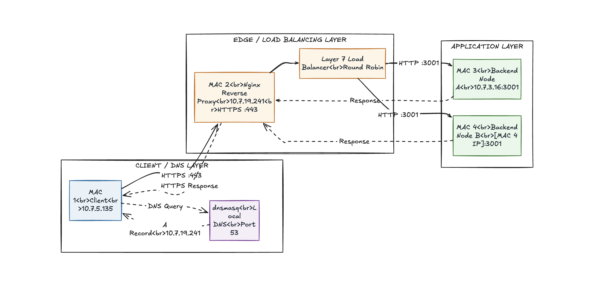
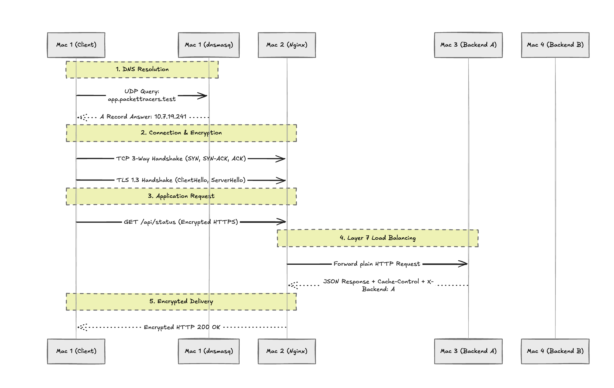

# Private Network Service Platform - Phase 1

This repository contains the configuration, source code, and evidence for a 4-node distributed web architecture built for the Computer Networks course project.

## Team Packet Tracers - Machine Roles & IP Inventory

| Machine | Role | Private IP | Interface | Services |
| :--- | :--- | :--- | :--- | :--- |
| **Mac 1** | DNS Server & Client | `10.7.5.135` | `en0` | `dnsmasq`, `dig`, `curl`, Wireshark |
| **Mac 2** | Edge Reverse Proxy | `10.7.19.241` | `en0` | `nginx`, TLS Certificates |
| **Mac 3** | Backend Node A | `10.7.3.16` | `en0` | Node.js API (Port 3001) |
| **Mac 4** | Backend Node B | `10.7.5.26` | `en0` | Node.js API (Port 3001) |

## 1. Architecture & Request Flow

Our local area network utilizes a completely private test namespace (`app.packettracers.test`). The request flow through our architecture operates as follows:
1. **Client (Mac 1)** initiates a request for the domain.
2. **DNS Query (Mac 1)** intercepts the request via `dnsmasq` and resolves it to Mac 2's IP.
3. **HTTPS Request (Mac 2)** catches the traffic via Nginx, terminates the TLS 1.3 encryption, and proxies the request.
4. **Backend A (Mac 3) or Backend B (Mac 4)** receives the load-balanced HTTP request and returns the JSON payload.

### Topology Diagram


### Request Flow Diagram


## 2. Configuration Bundle

### DNS Configuration (Mac 1)
Located in `/config/dnsmasq.conf`:
```text
address=/app.packettracers.test/10.7.19.241
address=/api.packettracers.test/10.7.19.241
listen-address=10.7.5.135,127.0.0.1
interface=en0
```

### Nginx Edge Configuration (Mac 2)
Located in `/config/nginx.conf`:
```nginx
upstream my_backends {
    server 10.7.3.16:3001;
    server [Mac 4 IP]:3001;
}

server {
    listen 443 ssl;
    server_name app.packettracers.test api.packettracers.test;

    ssl_certificate /opt/homebrew/etc/nginx/server.crt;
    ssl_certificate_key /opt/homebrew/etc/nginx/server.key;

    location / {
        proxy_pass http://my_backends;
    }
}
```

## 3. Deployment & Launch Instructions

### Step 1: Start Backends
On Mac 3 and Mac 4, navigate to the `/backend` directory and start the application on port 3001:
```bash
node server.js
```

### Step 2: Start Edge Proxy
On Mac 2, ensure the SSL certificates are generated (see `/docs/TLS_setup_notes.txt`) and reload Nginx:
```bash
sudo nginx -s reload
```

### Step 3: Flush DNS
On Mac 1 and Mac 2, flush the local DNS cache to ensure routing uses the private namespace:
```bash
sudo dscacheutil -flushcache; sudo killall -HUP mDNSResponder
```

## 4. Phase 1 Evidence
All required Phase 1 demonstration evidence is located in the `/evidence` folder, including:
- **DNS Resolution**: Output showing `dig app.packettracers.test` successfully resolving via Mac 1.
- **Wireshark Captures**: Analysis of the DNS UDP query, the TCP 3-way handshake, and the TLS 1.3 ClientHello/ServerHello sequence.
- **HTTP Headers & Caching**: Terminal output showing `Cache-Control: max-age=60` and HTTP 200 OK responses.
- **Failure Demonstration (D3)**: Video evidence proving the Layer 7 Nginx load balancer automatically routes traffic away from a downed backend node to maintain 100% uptime for the client.
